<h1 style="text-align: center;">SimTTL</h1>
<h2 style="text-align: center;">Digital Simulation of TTL Circuits</h2>
 

  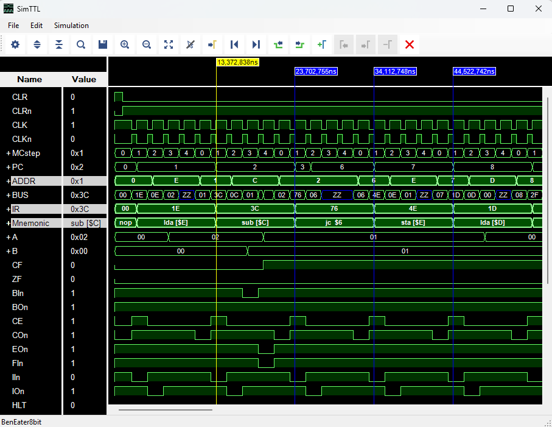

 
SimTTL is a simple simulator for TTL circuits to display the timing behavior similar to a logic analyzer. The GUI looks familiar to anyone programming and simulating Xilinx FPGAs. SimTTL can load KiCad-9 netlists to create an internal model. File names embedded in the schematics can be used to automatically load binaries into RAMs, ROMs or GALs for the simulation. A text file can provide the mnemonic information for a very simple disassembler.
  
<h3 style="text-align: center;">Background</h3>
 
After a friend demonstrated his <a href="https://eater.net/8bit/">"Ben Eater 8bit Computer"</a> to me, I got hooked into TTL computer designs. There are a number of examples, where people built a processor out of TTL chips. Another nice one is the <a href="https://gigatron.io/">"Gigatron – TTL microcomputer"</a>. While the first one just uses adder chips for the <a href="https://en.wikipedia.org/wiki/Arithmetic_logic_unit">ALU</a>, the Gigatron uses a combination of multiplexers and adders to achieve more functionality. I wanted to nice time diagrams of their functionality, and the idea was born to write a little program to do that.
 
So, the first attempt was creating a nice GUI that is close to what I used to work with for FPGA designs and then hardcoded the 2 schematics as examples. So far, so good. The next step was using the new tool to analyze and debug my own schematics, which required a KiCad-9 netlist import. Here is now a version, that helped me a lot and can be helpful for others as well.
  
<h3 style="text-align: center;">Repository Structure</h3>
<h4><b>/bin/</b></h4>
    - <b>SimTTL.exe</b> and DLLs: ready to run on Windows  
    - XML files containing settings for different sample cases 
    - <b>/BenEater8bit/</b>: Support files for BenEater implementation 
    - <b>/GigatronTTL/</b>: Support files for GigatronTTL implementation 
    - <b>/SimTTLFiles/</b>: Simulation examples for the TTL 6510 Computer design 
 
<h4><b>/source/</b></h4>
    - <b>SimTTL.sln</b>: Visual Studio C# Solution. 
    - <b>/SimTTL/</b>: Main project with GUI. 
    - <b>/SimBase/</b>: Project containing basic class definitions. 
    - <b>/ChipLibrary/</b>: A TTL chip collection project. 
    - <b>/Schematics/</b>: Basic schematics classes and examples. 
 
  
<h3 style="text-align: center;">Description</h3>
<h4>1. GUI</h4>

  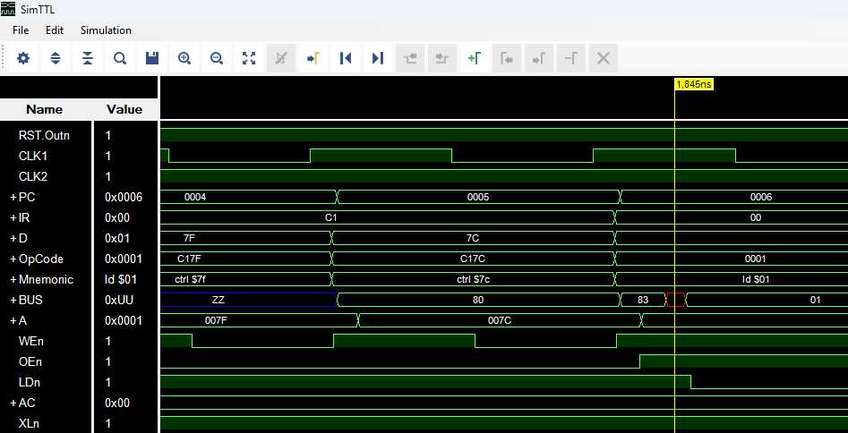

The layout is very simple. The main area is occupied with the signal time graphs. Left of that are the names and the values at the main cursor location. Single line signals are represented by an oscilloscope-like graph with the area below logic high filled to differentiate the high state from a low state. 
Enumerated signal groups are handled as a bus system and displayed together as high and low lines with transitions and the numerical value in between. The simulation handles not only H and L levels, but also Z (high-impedance) and U (undefined). The last one can occur when multiple outputs are active with different levels or inputs are open. Z and U are made visible in different colors (blue and red). 
There is a typical main menu at the top and a row of easily recognizable tool buttons.  

  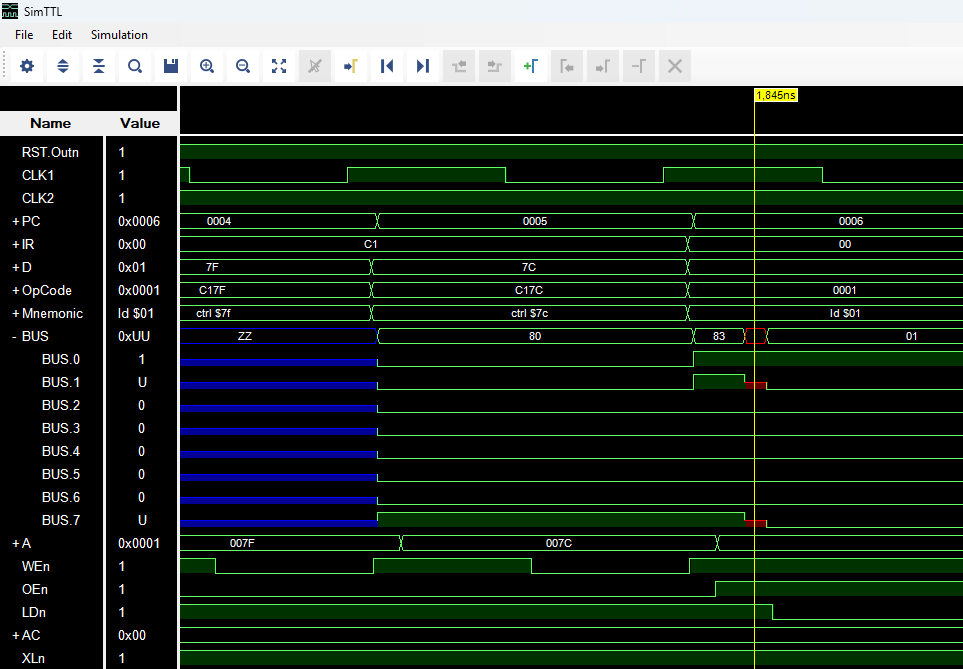

Bus groups can be expanded or collapsed again all at once with a pair of the tool buttons on top or individually at the + or - sign to the left of the name. In the screenshot above the expansion shows which individual signal of the bus was undefined. This can help to find the root cause.  

  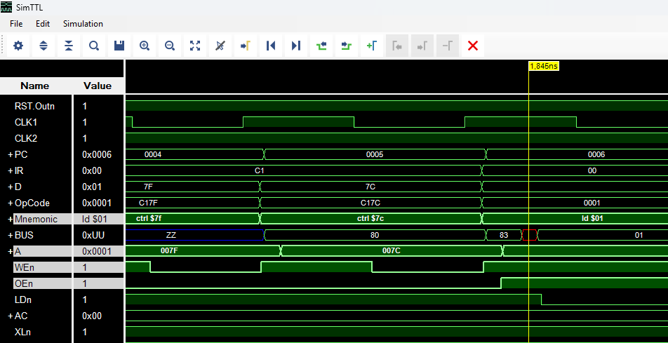

Signals can be selected by left-mouse-clicking on the name. CTRL and SHIFT can be used to select multiple signals. 
  

  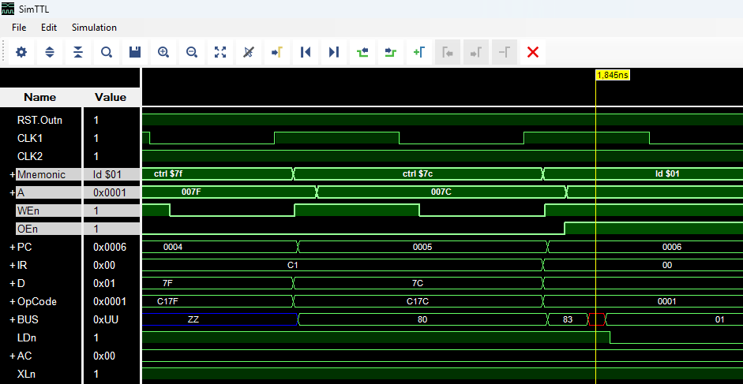

Selected signals can then be moved to a new position while holding the left mouse button down, moving to the new position and let the left mouse button go. If the selected signals are at the bottom and have to be moved to the top of a long list, use the mouse wheel to scroll while keeping the left mouse button down.
  

  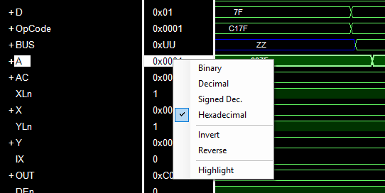

Right-clicking on a signal brings up a context menu which allows changing the radix of the displayed value. "Invert" inverts the bits before conversion and "Reverse" reverses the bit-order. This allows some flexibility for the value display. 
"Highlight" highlights a signal permanently until unchecked. In contrast to a selected signal, which loses the highlighted display when clicking somewhere else, this Highlight can be used as a permanent marker. 
  
<h4>2. File Menu</h4>

  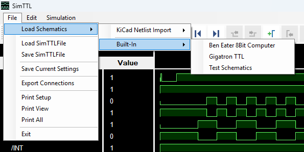

The file menu offers 2 major sources for loading a schematic: Hardcoded built-in or KiCad 9 Netlist. Clicking on the netlist import will show and OpenFileDialog to navigate to the netlist file. Previously opened files will be listed to the right of the import menu item for quicker access. 
Once a schematic had been loaded and simulated, it can be stored with all wave forms as a SimTTLFile. Few sample files are provided in the bin-folder, which can be loaded from the file menu. 
Saving the current settings will write all current GUI settings to the XML file for this schematic to be automatically loaded at next load. This function is useful when loading a netlist after changing GUI settings. 
The print menu items allow printing of the current view portion or everything over the required number of pages. 
Exiting the application will also automatically save the settings. 
Exporting connections can be useful for checking hardcoded or imported schematics against the design.
  
<h4>3. Edit Menu</h4>

  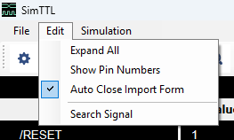

"Expand All" does the same as the tool buttons for expanding and collapsing.  
"Show Pin Numbers" applies to unlabeled signals of any chip in the schematics. For instance, a signal name could be "U1.1Y" and with the pin number it will show as "U1.1Y #2". 
"Auto Close Import Form" will automatically close the KiCad netlist import log form after the import. If unchecked, the log will have to be closed manually. 
"Search Signal" does the same as the magnifier tool button. It allows to bring a signal to the viewing area, that is above or below the current signals.  
  
<h4>4. Simulation Menu</h4>

  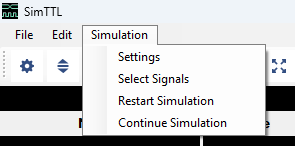

"Settings" opens up a dialog for general simulation settings and "Select Signals"pens up a dialog for selecting signals for displaying (see below).
"Restart Simulation" runs the simulation again from time 0. "Continue Simulation" continues from the last simulated time to the end (in case of previous abort) or for another time interval past the previous end.
  
<h5>4.1.1 Settings Dialog</h5>

  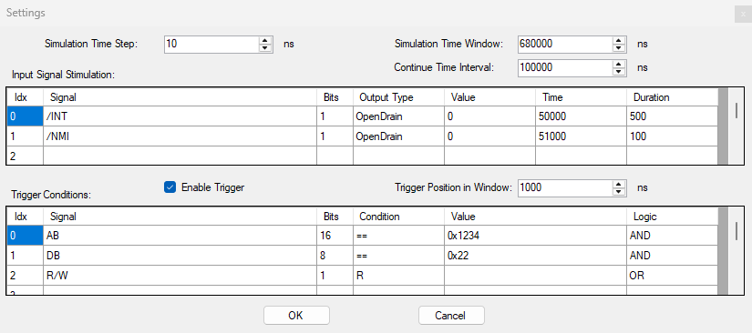

The settings dialog allows editing time value, stimuli and triggers. The "Simulation Time Step" is the simulation resolution. Lower numbers give higher resolution, but will also take longer to simulate. The "Simulation Time Window" is the maximum time from 0 in ns. The simulation will stop at that time value. The "Continue Time Interval" Is the time added to the end every time the "Continue Simulation" menu item is activated.  
The "Input Signal Stimulation" grid allows adding signal activation not specifically driven by the schematics. The example shows activation of interrupt lines at a defined time. 
The "Trigger Conditions" grid allows adding signal state combinations to cause a trigger event. In the current version, this event is just displayed. It is intended to run until the trigger condition is met and place that event at the requested position.
  
<h5>4.1.2 Stimuli and Triggers</h5>

  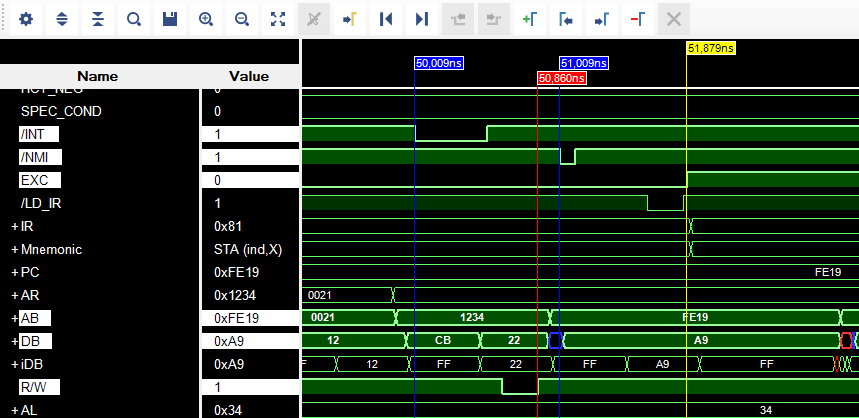

The settings above resulted in the screenshot here. The stimuli "/INT" and "/NMI" are activated at the requested time plus one simulation step (blue markers) The NMI resulted here in the activation of the EXC (Exception) signal with the next instruction execution starting with "/LD_IR" in this case marked with the yellow cursor marker. 
The red marker is automatically placed at the time, where the trigger condition had been met.
  
<h5>4.2.1 Select Signals Dialog</h5>

  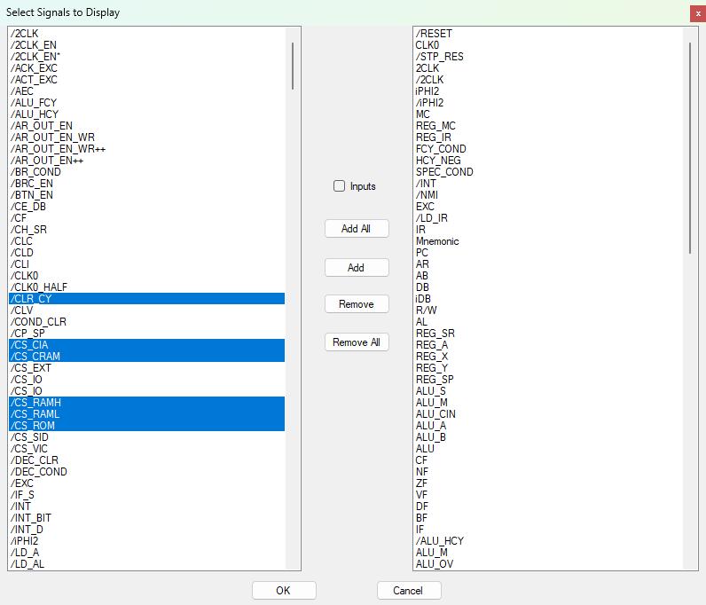

The left side lists all available pins and labeled signals in alphabetical order to select from. The right side lists all currently selected signals in the order they are displayed in the main view. Signals can be selected on either side by left-clicking individually or in groups using CTRL or SHIFT. The "Add" button will add selected signals from the left and add them to the end of the right list. To remove signals, select signals on the right and hit the "Remove" button.
  
<h5>4.2.2 Select Signals Dialog - Inputs</h5>

  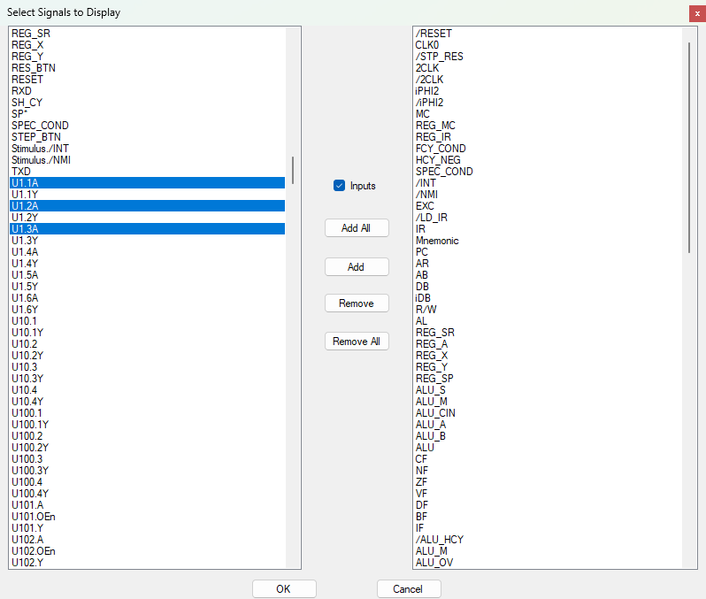

By default, the left side only lists labeled signal and outputs, because the outputs are normally most interesting for the analysis. When checking the "Inputs" checkbox, the left side additionally lists all input pins to select from. The example shows some selected inputs. This can help debugging states at an input. 
